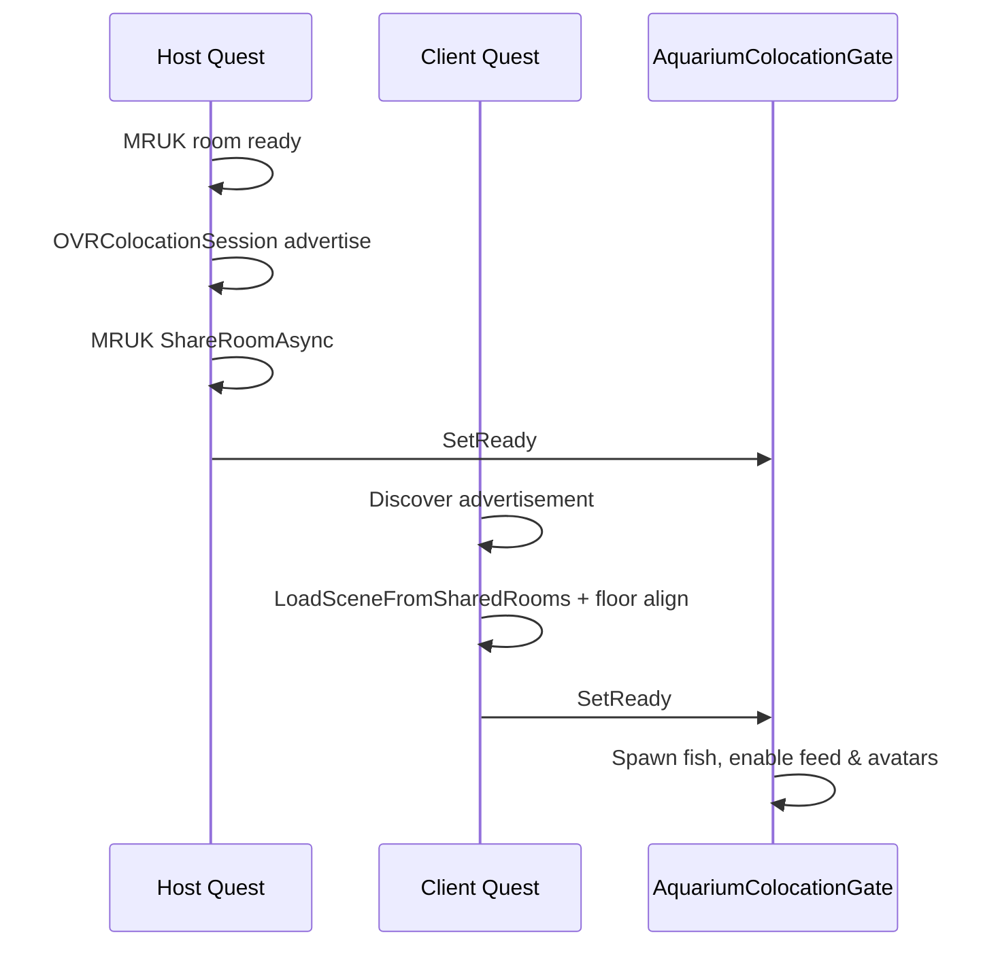

# 🐟 Collaborative MR AquaTwin

**Collaborative MR AquaTwin** is a multiplayer mixed reality aquarium project developed using **Unity 6** and **Meta Quest 3**.

This project explores **Digital Twin** behaviour in MR, combined with **Meta Colocation** and **MR Utility Kit (MRUK)** room sharing, so multiple users in the same physical space can see the same virtual aquarium, feed fish on real surfaces, and collaborate in a shared spatial frame.


## Key Features

### 1. Behavioral Digital Twin

- **Boids collective intelligence**: Separation, alignment, and cohesion on the Host, synchronised to all clients in real time.
- **Environmental reverse control**: Adjust water temperature and lighting from the floating **Digital Twin Console** to change fish speed and water colour.
- **MR-aware bounds**: When an MRUK room is loaded, fish stay inside scanned room geometry; otherwise a fallback volume is used.

### 2. Colocation & Shared Space (MRUK + OVRColocationSession)

Spatial alignment no longer relies on a manual “pinch and hold at a table corner” step. The project uses **Meta’s Colocation API** together with **MRUK shared rooms**:

| Role | Flow |
|------|------|
| **Host (Quest)** | Waits for MRUK room scan → advertises a Colocation session (payload: Fusion session name, room UUID, floor pose) → `ShareRoomAsync` to the group |
| **Client (Quest)** | Discovers the Host advertisement → `LoadSceneFromSharedRooms` → aligns tracking space to the Host floor frame |
| **Editor / PC** | Skips Colocation and marks the gate ready for local Fusion testing |

**`AquariumColocationGate`** is the global readiness flag. Until it is ready:

- Host does **not** spawn fish / environment (`AquariumManager`)
- Players **cannot** spawn food (`PlayerActions`)
- Local avatar sync to Host is paused (`AvatarMovement`)
- The aquarium glass volume is placed on MRUK furniture only after alignment (`FishTankVolume`)

**Solo Host**: If only one player is in the session, spawn can proceed after MRUK is ready even when advertise/share fails (configurable bypass on `AquariumColocationController`).

**In-headset HUD**: `FusionSessionStatusHUD` shows network role, player count, and spatial alignment (`Aligned` / `Waiting…`). Use **two Quest devices** in the same room to validate Colocation end-to-end.

Fusion and Colocation share the same session id: `AquariumSessionConfig.FusionSessionName` (`"AquariumRoom"`).

### 3. MR Food & Gesture Feeding

Feeding is built for **real-world surfaces**, not a floating abstract tank only:

- **Spawn**: Right-hand **index pinch** (with improved index-tip / interaction-joint pose). Editor: mouse click or VR controller trigger. Host authority spawns the networked food prefab via RPC.
- **Placement & fall**: `MRFoodPhysics` drives **kinematic fall** onto MRUK standable anchors and **FLOOR / TABLE** EffectMesh colliders (Unity rigidbody physics against EffectMesh is unreliable on Quest).
- **Lifecycle**: `FoodLife` syncs position over the network, rests on detected support, and despawns after ~30s.
- **Fish behaviour**: `SimpleBoid` steers toward the nearest `Food` tag object, suppresses flocking noise when close, slows and turns more aggressively near food, and **despawns** food when within eat radius (Host authority).

Food spawn is blocked until `AquariumColocationGate.IsReady`, so all players feed in the same aligned frame.

### 4. Immersive MR Interaction

- **Player scare**: Fish avoid avatars tagged `Player` within a scare radius.
- **Wall avoidance**: `MRSurfaceAvoidance` pushes fish away from MRUK room surfaces.
- **Underwater ambience**: Translucent water, particles, caustics, and Passthrough background.

## Tech Stack

- **Engine**: Unity 6 (LTS)
- **Platform**: Android (Meta Quest 3) / Windows (Editor debug client)
- **Networking**: [Photon Fusion 2](https://doc.photonengine.com/fusion/current/getting-started/fusion-intro) (Host mode)
- **XR**: Meta XR Core SDK / OpenXR
- **Spatial**: [Meta MR Utility Kit (MRUK)](https://developers.meta.com/horizon/documentation/unity/unity-mrutilitykit-overview) — room scan, EffectMesh, shared rooms
- **Colocation**: `OVRColocationSession` (advertise / discover / group UUID)
- **Architecture**: Server authoritative (Host) + client input for gestures and avatar pose

## Getting Started

### Prerequisites

- Unity **6000.3.2f1** (or compatible Unity 6 LTS used by the project)
- Meta Quest 3 (Developer Mode enabled)
- Photon Fusion **App ID**
- For Colocation testing: **two Quest 3** headsets in the **same physical room**, with room scanning enabled

### Installation

1. Clone the repository:

   ```bash
   git clone https://github.com/BakkaRaki/DCDC_FishTank.git
   ```

2. Open the project in Unity.

3. Open **Tools → Fusion → Fusion Hub** and set your **App ID** in Fusion App Settings.

4. **File → Build Settings** — scene order:

   | Index | Scene |
   |-------|--------|
   | 0 | `BootScene` |
   | 1 | `GameScene` |

5. Ensure the Oculus / Meta project config enables **Colocation session support** (already set in `OculusProjectConfig.asset` for this repo).

### How to Run

1. **Host (Quest 3)**  
   Build and Run on device → put on headset → **Start Host**.  
   Allow MRUK to finish room capture. Wait until the status HUD shows **Spatial: Aligned** (or solo bypass message).

2. **Client (second Quest 3)**  
   Same Wi‑Fi / proximity as Host → **Join Client**.  
   Client discovers Colocation, loads the shared MRUK room, and aligns to the Host floor.

3. **Editor / PC (optional)**  
   Play in Editor → **Join Client** or **Start Host**. Colocation is bypassed; MRUK may load from `EditorSceneJson` on desktop. Useful for Fusion and Boids debugging, not for validating shared space on device.

4. **Feeding**  
   After spatial **Aligned**, pinch with the right hand to spawn food on tables or floor surfaces. All clients see the same food positions.

## Controls

| Action | Input | Notes |
|--------|--------|--------|
| **Spawn food** | Right hand: **index + thumb pinch** | Cooldown ~0.5s; requires spatial gate ready |
| **Spawn food (debug)** | **Mouse click** or **VR trigger** (right controller) | Editor / fallback spawn in front of camera |
| **Environmental control** | Touch sliders on the floating panel | Temperature and light intensity |
| **Scare fish** | Move body / hands near the school | Boids flee from `Player`-tagged avatars |
| **Spatial alignment** | Automatic on Quest (Colocation + MRUK) | No manual left-hand calibration in the main flow; legacy `HandColocation.cs` remains for reference only |

## Project Structure

```
Assets/Scripts/
├── AquariumColocationController.cs  # Host advertise + MRUK share; Client discover + load
├── AquariumColocationGate.cs          # Global “spatial ready” gate
├── AquariumSessionConfig.cs           # Shared Fusion / Colocation session name
├── AquariumManager.cs                 # Fish & environment spawn (after gate)
├── MRUKBootstrap.cs                   # Room load, EffectMesh / RealWorld colliders
├── FishTankVolume.cs                  # Networked tank volume; MRUK table/couch/floor placement
├── MRFoodPhysics.cs                   # Kinematic food fall & surface queries
├── FoodLife.cs                        # Networked food lifetime & sync
├── PlayerActions.cs                   # Pinch / RPC spawn food
├── SimpleBoid.cs                      # Boids + food attraction + MRUK bounds
├── MRSurfaceAvoidance.cs              # Fish vs room surface repulsion
├── EnvironmentSystem.cs               # Temperature / light [Networked]
├── AvatarMovement.cs                  # Head pose → Host (gated on colocation)
├── PlayerHandSync.cs                  # Hand pose sync (if enabled on prefab)
├── FusionSessionStatusHUD.cs          # In-headset network + spatial status
├── ConnectionManager.cs               # Host / Client; resets colocation gate
├── HandColocation.cs                  # Legacy manual calibration (not used in main flow)
└── DashboardUI.cs                     # Digital twin panel UI
```

## Core Behaviour

### Colocation pipeline



### Boids and food

Fish logic in `SimpleBoid.cs`:

1. **Separation / alignment / cohesion** among neighbours.  
2. **Food steer**: nearest `Food` tag within extended vision; urgency increases when closer.  
3. **Eat**: within `FoodEatRadius`, Host despawns the food `NetworkObject`.  
4. **Scare** from players and MRUK surfaces.

Near food, flocking and noise are reduced so fish commit to the bait.

### Food physics

`MRFoodPhysics` caches floor and standable surfaces from MRUK, probes downward with a sphere cast on the **RealWorld** layer, and simulates gravity in `FixedUpdateNetwork` without enabling food rigidbodies. This keeps pellets on scanned tables and floors for all players in the shared room.

## License

This project is licensed under the MIT License — see [LICENSE](LICENSE).
